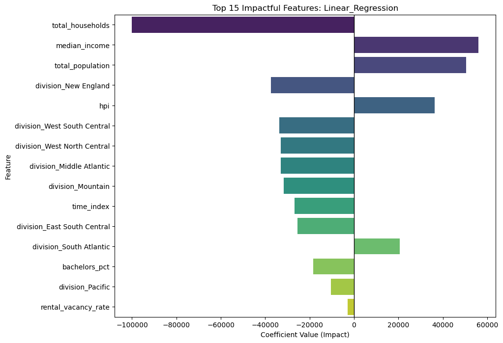
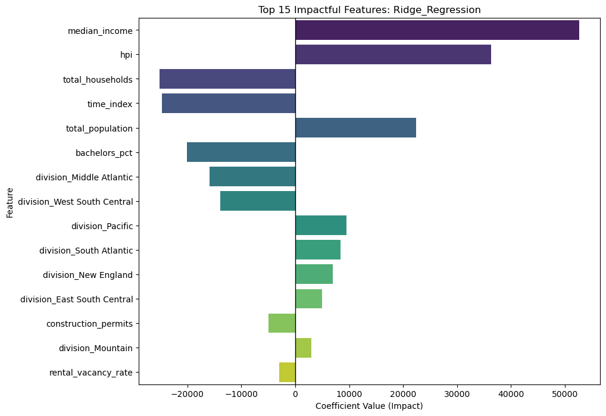
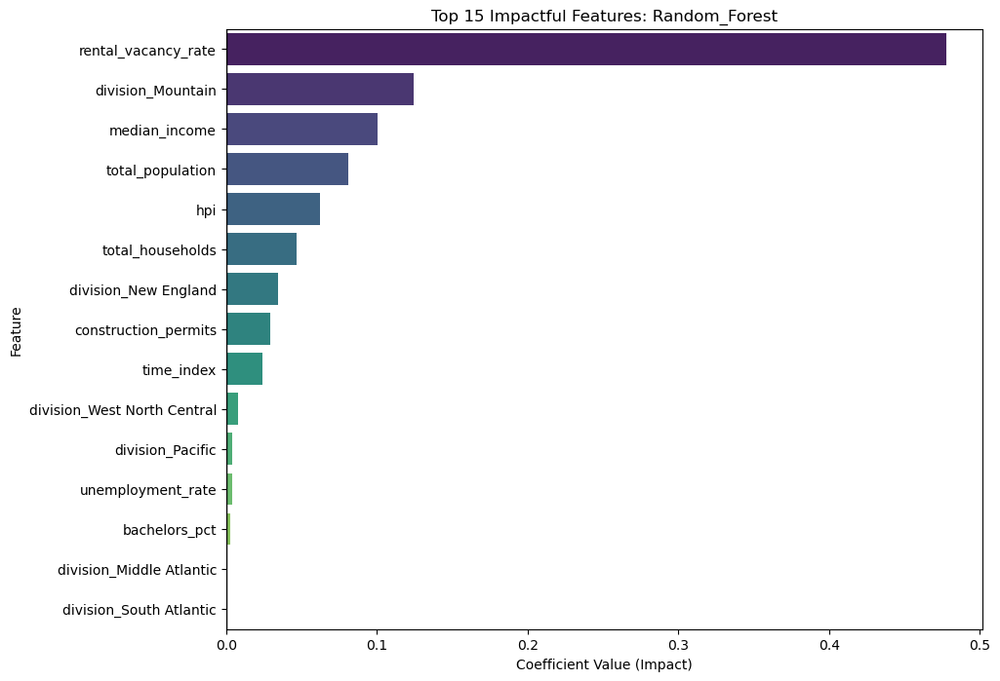

# CS506-Zillow-Home-Index-Forecasting-Model

## How to Build and Run the Code

To reproduce the current project pipeline, run:

```bash
make install
make clean-data
make features
make model
make test
```

If the cleaned and expanded datasets are already present, the shortest path is:

```bash
make install
make model
make test
```

### What each command does

- `make install`: installs project dependencies from `requirements.txt`
- `make clean-data`: rebuilds `data/processed/df_clean.csv`
- `make features`: rebuilds `data/processed/df_clean_with_all_features_model_ready_2010_2024.csv`
- `make model`: runs the model comparison pipeline and writes prediction/result files to `outputs/`
- `make test`: runs the test suite

## Supported Environment

- Python `3.10+`
- Tested in a Unix-like shell environment such as macOS or Linux

**Description**: Build a home price forecasting model using Zillow’s home index time series across U.S. metros and explain what drives home changes. By drives, we mean predictive importance, not causation. We will identify “drivers” as the features that measurably improve out-of-sample prediction and/or are consistently selected as important by the model. We will use Lasso penalization to determine this.

**Goal**: Predict next month/quarter home index value for each location with low error and rank the strongest drivers of home growth. We are not trying to compute or recreate ZORI using Zillow’s underlying index construction methodology. The goal is a standard out-of-sample forecasting task: using data available up to time t to predict future, not-yet-observed ZORI values at t+1. Essentially, we treat the published ZORI series as the target label, build a model/models that map predictors to future ZORI, and then evaluate performance on a time period using MAE/RMSE. Additionally, ZORI cannot be computed exactly from the historical ZORI series we download, because Zillow constructs it from unit-level repeat-home observations and applies reweighting and smoothing steps that require underlying listing data we don’t have. Our project is therefore to forecast future published ZORI values out-of-sample, not to reconstruct Zillow’s internal index calculation.

**Data collection**: Use Zillow Research CSVs and optionally merge public economic indicators like unemployment rate and home price index, which measures the rate of change in residential property prices, by geography and date. To build on this, we also collected building permits, rental vacancy rate, and total households to add regional context about housing supply, housing availability, and household demand.

For building permits, we parsed the U.S. Census Building Permits Survey spreadsheet, extracted yearly permit totals, cleaned the data, mapped states to U.S. Census divisions, and summed permits by year and division. For rental vacancy rate and total households, we made Census API requests using ACS data by state and year, selected the needed fields, cleaned the responses into dataframes, and aggregated them to the division level. Total households was summed, while rental vacancy rate was weighted by total housing units.

After processing, we merged these annual features into the monthly housing panel using year and Census division. Since these variables are annual and Zillow data is monthly, each yearly value was attached to the matching months in that year. These features are used as predictive signals, not causal claims, to help improve out-of-sample ZHVI forecasting.

For median income, total population, and education level, we used annual American Community Survey (ACS) tables and extracted county-level estimates for total population, median household income, and the share of the population age 25 and over with at least a bachelor’s degree. We cleaned the ACS files, mapped each county to its U.S. Census division based on state, and then aggregated the data to the division-year level so it could align with the Zillow panel. Total population was summed across counties, while median income and bachelor’s attainment were aggregated using population-weighted averages to better reflect the composition of each division. Because ACS coverage begins later than the Zillow series, we used the feature-augmented sample from 2010 onward, merged these annual variables into the monthly panel using division and year, forward-filled only limited within-division gaps where needed, and dropped rows that still lacked ACS values after processing.

**Modeling**: Compare Linear Regression, Ridge Regression, and Random Forest models on engineered housing and economic features to predict the next month’s home index value. We are not computing or reverse-engineering the index(ZORI) formula. We will treat the published home index series as the target label and build a model that forecasts future, unobserved months/quarters. The index may have a methodology, but future values are not computable today because they depend on future market conditions and data.

**Visualization**: Scatter Plot with a fitted regression showing the correlation of between Home Price Index (HPI) and Zillow Home Value Index (ZHVI). The points  mapped are based on same date, division, and unemployment rate.
The highest correlation came from the median income feature as the feature correlation score was 0.78. If you look at the heat map, you could see how much each feature we have extracted correlates to ZHVI.


We can also distinguish the ZHVI trend by division to provide even more accurate results. More data visualization is available under 'data_visualization.ipynb'.


**Test plan**: Use time-based split and report MAE/RMSE

## Testing

The included tests focus on a few core parts of the pipeline:

- loading the expanded modeling dataset
- preprocessing data into model-ready features
- verifying that the time-based train/test split respects chronology
- confirming that model training and evaluation run end to end

Run tests with:

```bash
make test
```

## GitHub Workflow

GitHub Actions is configured to run the test suite automatically on pushes and pull requests.

The workflow:

- checks out the repository
- sets up Python
- installs dependencies
- runs `make test`

## Contributing

1. Create a branch for your changes.
2. Keep changes focused and documented.
3. Run `make test` before pushing.
4. Update the README if setup, usage, or outputs change.

## Modeling

For our modeling, we chose three distinct approaches.
First, we established Linear Regression as our baseline. Its primary role was Interpretability. In the housing world, stakeholders want to know the direct 'dollar-for-dollar' impact. This model allowed us to quantify exactly how a thousand-dollar increase in local income translates into a specific rise in home value.

However, housing data is notorious for multicollinearity. For example, 'Total Population' and 'Total Households' often move similarly, which can cause a standard Linear model to overfit or give wild, unstable weights to those features. To solve this, we used Ridge Regression with an Alpha of 1.0. By applying an L2 Penalty, we shrank those noisy coefficients, forcing the model to be more stable and reliable .

Finally, we utilized Random Forest with 100 estimators. We chose this because the housing market isn't always a straight line, it's full of complex, non-linear interactions. A linear model assumes an income boost always has the same effect, but a Random Forest can realize that an income boost matters more when the vacancy rate is extremely low. 
## Results

The primary goal of this project was to determine if regional home values (ZHVI) could be accurately predicted using economic indicators—such as Median Income, Unemployment, and Rental Vacancy.  

The project was successful as our best model explained 91.5% of the variance in home prices across different U.S. regions, proving that economic fundamentals are a powerful and reliable anchor for market value.



Looking at the coefficient graph for the Linear Regression Model.  The model is heavily anchored by Median Income. This makes sense as where people make more money, they bid up house prices. However, looking at the confliction between Total Population and Total Households we can see the model deals with collinearity because these two features are so similar, the linear model is essentially 'fighting' with itself to find the perfect fit. It’s effective for prediction, but it shows the model is a bit unstable when features overlap.




Next, looking at the Ridge coefficients. By applying that L2 penalty, we forced the model to stop over-relying on the population overlap. Instead, it identifies Median Income and the Home Price Index as the true, stable pillars. This makes a lot of logical sense as  house prices are a mix of what people earn locally and how the national market is trending.




On the other hand, The Random Forest chart tells a completely different story. While the linear models focused on wealth, the Forest focuses on scarcity. Nearly 50% of the model's logic is driven by the Rental Vacancy Rate. It discovered that if there are no empty homes, prices will skyrocket regardless of how much people earn. Also notice the Mountain Division is much more impactful here. The Forest picked up on the recent migration 'hot spot' in those states, a trend that doesn't follow a straight line and would have been missed by the other model.

The comparison of our three models demonstrated that in a trending market, linear relationships are the most effective predictors.

| Model  | MAE| RMSE |  $R^2$ |
| ------------- | ------------- | ------------- | ------------- |
| Linear Regression   | $31,074.18  | $34,573.93 | 0.9150 |
| Ridge Regression  | $34,221.88  | $37,664.90 | 0.8991 |
| Random Forest  | $47,502.02  | $79,879.95 | 0.5460 |

 Our best model was Linear Regression. It achieved an $R^2$ score of 0.915, meaning it explained over 91% of the variation in home prices. With a Mean Absolute Error of about $31,000, it proved remarkably accurate at predicting regional values based purely on economic fundamentals.

Ridge Regression followed closely behind with an $R^2$ of 0.899. While its error was slightly higher than the standard linear model, it gave us much more stable coefficients, which makes it a more reliable tool for long-term economic forecasting where variables often overlap.

Surprisingly,  Random Forest had the weakest performance by a significant margin, with an $R^2$ of only 0.546 and double the error of our linear models.
This is due to the fact that we trained the model on data up to 2021 and tested it on the record-breaking price spikes of 2022 to 2024. As a tree-based model, it struggled to predict values higher than anything it had seen in its training set.

Ultimately, these results tell us that the U.S. housing market is currently driven by a strong, linear upward trend with factors like income and hpi.


## Youtube Video Presentation
https://youtu.be/-y_m_SK9O40 
